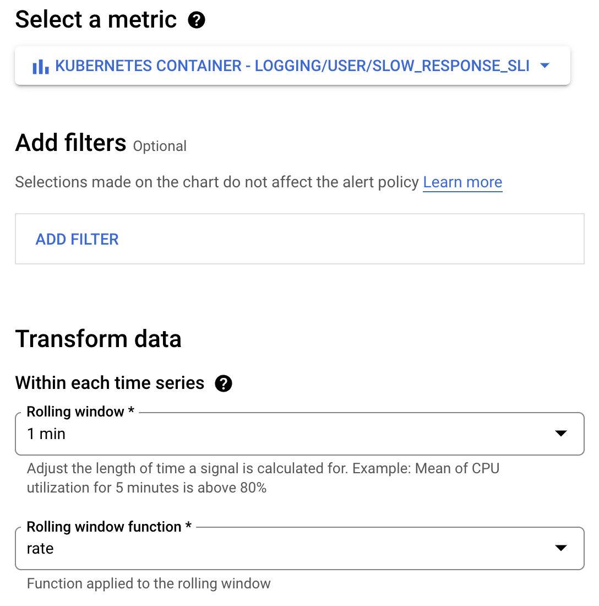
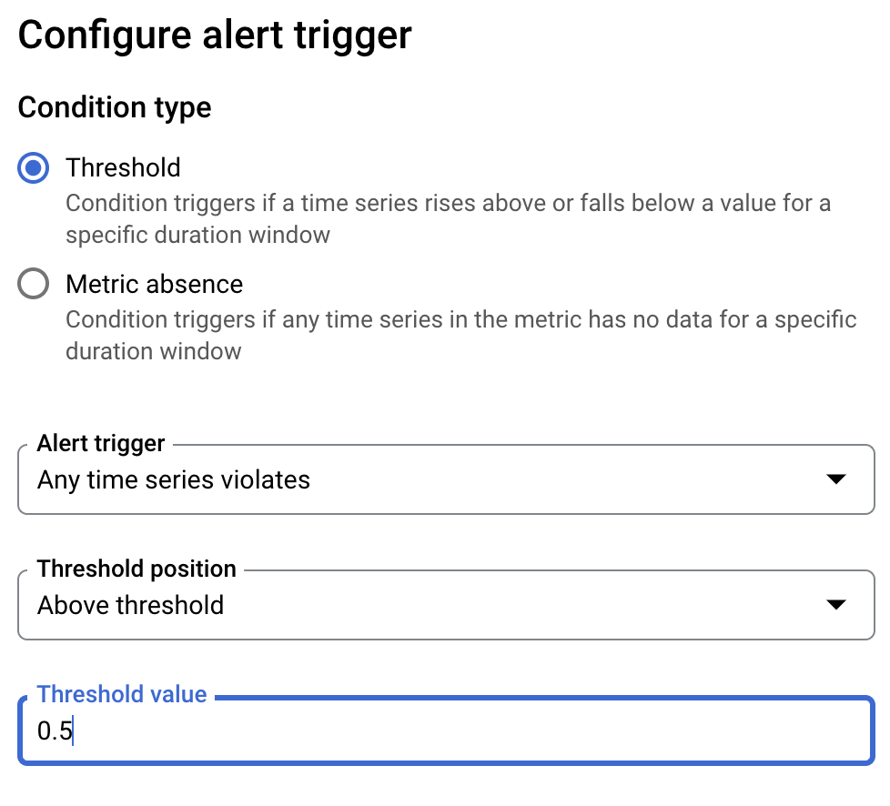
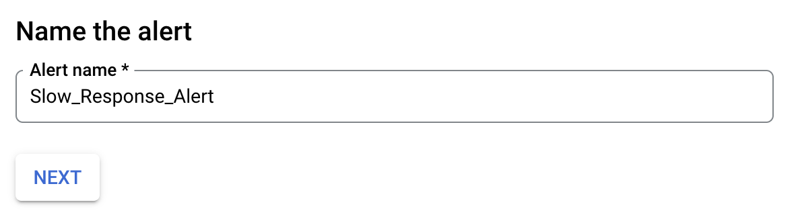

# Logging and Monitoring on GKE Challenge Lab

## Overview
Cloud Logging and Cloud Monitoring are full featured products that are both deeply integrated into Google Kubernetes Engine. This lab teaches you how to use both products for some Day2 ops work with GKE clusters and applications.

## What you will learn
In this lab, you will learn how to do the following:

- Mange log buckets in Cloud Logging
- Query and analyze logs
- Create and update dashboards in Cloud Monitoring
- Create logs-based metric and alerting policy

## Deploy Application
1. Clone the [microservices demo](https://github.com/GoogleCloudPlatform/microservices-demo) repo
2. Apply the manifests in the release directory to the `prod-cluster`
3. Verify the Pods are running
4. Check the external IP of the `frontend-external` Service through the GKE Services Dashboard and try to access the Service

## Logging

### Manage Log Buckets
1. Edit the \_Default log bucket's retention period from 30 to 300 days
2. Create a new log bucket `day2ops-log`
3. Query `resource.type="k8s_container"` in the Logs Explorer
4. Create a Log Sink with the name `day2ops-sink`
5. Read from the new `day2ops-log` bucket by refining the scope

### Log Analysis
1. Query logs containing a "POST OR GET", take some time to analyse the resulting logs
2. Explore the example Queries in the library

## Monitoring GKE Cluster

### Default GKE Dashboard
1. View the Default GKE Dashboard and filter the `prod-cluster`

### Import a sample GKE Dashboard
1. Import the **GKE Cluster Monitoring** dashboard
2. Edit the `Node - Bytes received[MEAN], Bytes received[MAX].` dashboard

- Mean for the Legend template of Time series A
- Max for the Legend template of Time Series B

## Monitoring Applications

### Create a Logs-Based Metric
1. In the Logs Explorer run the following query

```json
{jsonPayload."http.resp.took_ms" > 50}
```

2. Create a Logs based Metric using a Counter Type called **Slow_Response_SLI**

### Create an Alerting Policy
1. Create an Alerting Policy using the previously created **Slow_Response_SLI** Metric
2. Use the following parameters for your Alerting Policy
   
   
   

### Trigger an Application Performance Issue
1. Edit the loadgenerator's Deployment Resource, udating the USERS env variable to 150
2. Verify an Alert has fired for the **Slow_Response_Alert**
3. View the incident details
4. View the logs viewer page to identify the http response time (hint look for http.resp.took_ms)
5. Apply the Kubernetes Resources in release directory to fix the issue
